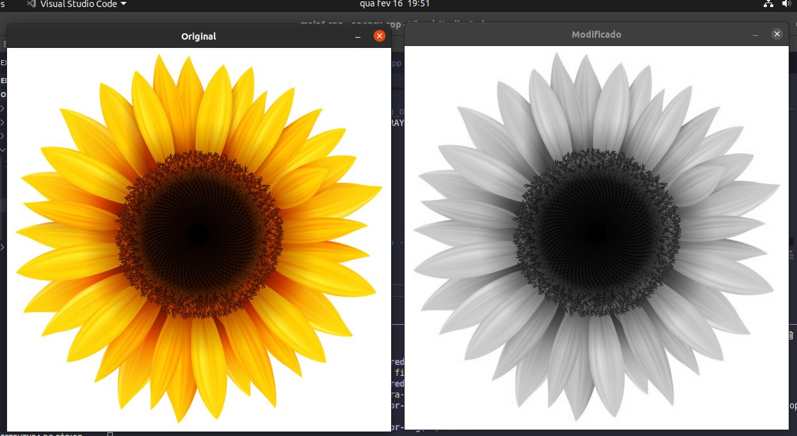
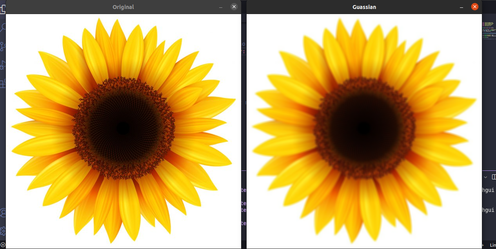
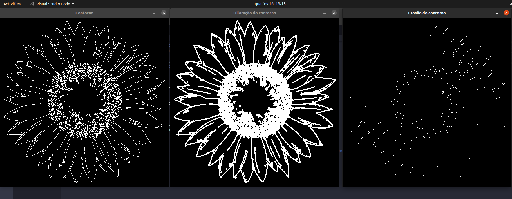

# Descrição dos arquivos main's

## main1.cpp

> alterando cor da imagem com as conversões de espaços de cores com a função cvtColor da lib opencv;

## main2.cpp

> desfocando imagem com filtro, a partir da função GaussianBlur da lib opencv;

## main3.cpp

> aplicando alguns conceitos de operações morfológicas (dilatação e erosão) de imagens;

